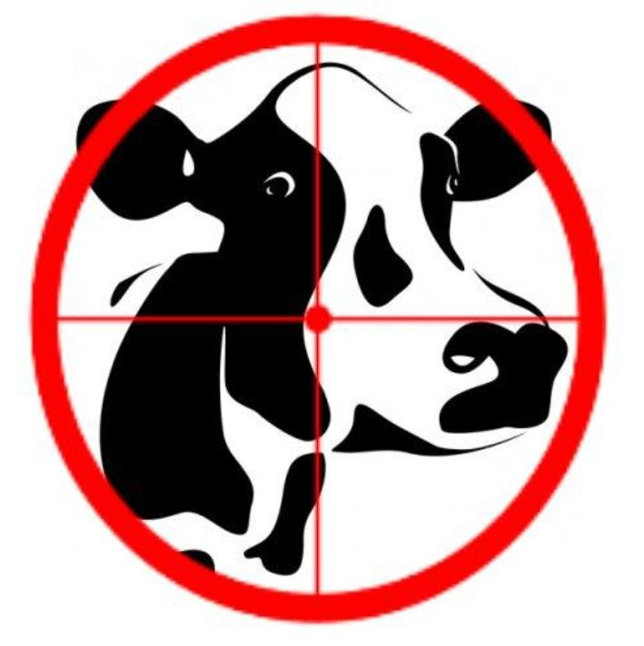

Cow Finder
=============
The goal of this project is to sucesfully identify cows in any airial image using datamining techniques. The key components of this project are as follows.

  - Create a classifier that finds cows in large images
  - Evaluate the algorithm with ROC curves
  - Write a report

Report
------------
Link: https://docs.google.com/document/d/1gx65E14Ts43-IrGvkxc12u1dDmNxFzNBRwTpX6R1rOc/edit?usp=sharing
 
Matlab example code
--------------------

EDU>>imdata=imread('cows1.jpg');
EDU>>image(imdata)
EDU>>[y,x]=ginput(1)

y= 643.8095
x= 250.2208

EDU>>red=imdata(round(x),round(y),1);
EDU>>green=imdata(round(x),round(y),2);
EDU>>blue=imdata(round(x),round(y),3);
EDU>>figure;
EDU>>patch(px,py,double([red green blue])/255)

